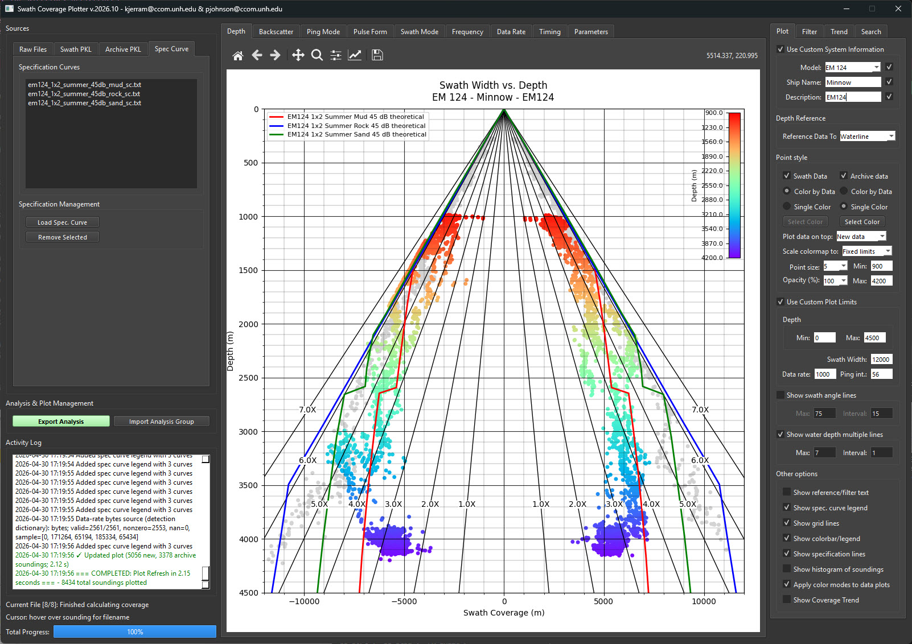

# Swath Coverage Analysis Tools



A comprehensive toolkit for analyzing swath coverage data from Kongsberg multibeam systems. This project provides two main applications for processing, converting, and visualizing swath coverage data.

**Center for Coastal and Ocean Mapping (CCOM) / Joint Hydrographic Center (JHC), University of New Hampshire**

## Overview

This toolkit consists of two complementary applications:

1. **KMALL to PKL Converter** - Converts raw KMALL/ALL files to optimized PKL format for faster processing
2. **Swath Coverage Plotter** - Comprehensive GUI application for analyzing multibeam sonar data during a swath coverage test

---

## Applications

### 1. KMALL to PKL Converter

A standalone GUI application that converts Kongsberg multibeam data files (KMALL and ALL formats) to optimized PKL (pickle) files for faster loading and processing in the Swath Coverage Plotter.

#### Key Features
- **Simple GUI Interface**: Easy-to-use graphical interface for file selection and conversion (Fusion dark theme)
- **Batch Processing**: Convert multiple files at once
- **Directory Support**: Add entire directories with optional recursive subdirectory search
- **Archive Mode**: Optional `Make Archive PKL` mode creates a single archive PKL from all selected raw files
- **Progress Tracking**: Modal progress dialog with current file status during conversion
- **Compression Support**: Optional gzip compression for 30-70% smaller files
- **Fast Coverage-Only Read**: Uses the same optimized plot-mode KMALL reader as the plotter (outermost soundings only)
- **Index Sidecar Cleanup**: Temporary `.swathcov.idx` index files are removed after each KMALL conversion
- **Error Handling**: Comprehensive error reporting and logging
- **File Validation**: Automatic detection of up-to-date files (skip if newer)

#### Usage

**Method 1: Python Script**
```bash
python kmall_to_pkl_converter.py
```

**Method 2: Windows Executable**
```
KMALL_to_SwathPKL_Converter_v2026.06.exe
```
Executables are named `KMALL_to_SwathPKL_Converter_v` + version from the code.

See also [KMALL_TO_PKL_README.md](KMALL_TO_PKL_README.md) for converter-specific options (overwrite, **Store files in SwathPKL Directory**, session settings, and archive mode details).

**Basic Workflow:**
1. Launch the application
2. Add files using one of the following methods:
   - Click **Select KMALL/ALL Files** to choose individual files
   - Click **Select Directory** to add all KMALL/ALL files from a directory
   - Enable **Include Subdirectories When Adding A Directory** to search subfolders recursively
3. Choose an output directory for the converted PKL files
4. Set options:
   - **Enable compression** for smaller files (recommended)
   - **Overwrite existing PKL files** to replace outputs, or leave off to skip up-to-date PKLs
   - **Store files in SwathPKL Directory** to write PKLs into a `SwathPKL` subfolder under the output path
5. Optional: enable **Make Archive PKL** to output one archive file instead of per-file Swath PKLs
6. If archive mode is enabled, enter the archive basename when prompted
7. Click **Start Conversion** and monitor the progress dialog and log

---

### 2. Swath Coverage Plotter

A comprehensive GUI application for analyzing and visualizing multibeam echosounder data with extensive plotting and analysis capabilities. The window is fixed at **1600 × 1100 px** and uses a dark Fusion theme.

#### Key Features
- **Multiple Data Sources**: Load raw KMALL/ALL files, Swath PKL files, or archived data
  - Add Directory with optional **Include Subdirectories** for Raw, Swath PKL, and Archive PKL
  - Show Path toggle for each file list
  - Separate **Convert to Swath PKL** and **Convert to Archive PKL** groupboxes on the Raw tab
- **Fast KMALL Processing**: Optional `.swathcov.idx` index sidecars, single-pass extraction, and plot-mode outermost-sounding reads
- **Extract Timing** (optional): Parse SKM datagrams and show the Timing plot tab when enabled during coverage calculation
- **Save Index** (optional): Keep KMALL index sidecars after **Calculate Coverage** for faster re-indexing; PKL conversion always removes sidecars
- **Comprehensive Plotting**: Generate plots for depth, backscatter, depth mode, pulse form, swath mode, frequency, data rate, and timing
- **Interactive Visualization**: Hover over data points to see the source filename in the status bar
- **Coverage Trend Analysis**: Calculate, edit, digitize, and export swath coverage trends
- **Data Filtering**: Filter by angle, depth, width, backscatter, ping interval, and runtime parameters
- **Archive Management**: Archive processed data for later comparison
- **Archive Conversion from Raw Files**: **Convert to Archive PKL** can auto-calculate coverage first when needed
- **Archive Conversion from Swath PKL**: **Convert to Archive PKL** on the Swath PKL tab converts loaded Swath PKL data directly to one Archive PKL
- **Export Functionality**: Save all plots and export coverage trends (e.g., for Gap Filler)
- **Analysis Group Export/Import**: Export plots + `settings.txt` + analysis JSON, then re-import sources and Plot/Filter settings; remembers parent directory and save name between sessions and repeated exports
- **Enter-to-Commit Parameters**: Numeric fields apply on **Enter**; uncommitted edits show an amber/orange border
- **Editable Filter Fields When Off**: Set filter/limit values before enabling a filter; inactive fields stay editable but visually dimmed
- **Parameter Search**: Search acquisition parameters by mode, frequency, angles, and more
- **Runtime Parameter Table**: Parameters tab shows an acquisition-parameter table with changed values highlighted vs. the previous row
- **Theoretical Performance**: Overlay theoretical coverage specification curves
- **Session Persistence**: Remember directory preferences and settings
- **Dark Theme**: Fusion style with dark palette for consistent appearance
- **Modal Progress Dialogs**: Calculate Coverage, Scan Parameters Only, PKL conversion, and PKL loading show a progress dialog with the current file; no persistent progress bars in the left panel

#### Usage

**Method 1: Python Script**
```bash
python swath_coverage_plotter.py
```

**Method 2: Windows Executable**
```
Swath_Coverage_Plotter_v2026.12.exe
```
Executables are named `Swath_Coverage_Plotter_v` + version from the code.

**Basic Workflow:**
1. Launch the application
2. Load data using one of the following methods:
   - **Raw tab**: Add KMALL/ALL files, optionally enable **Save Index** and **Extract Timing**, then click **Calculate Coverage**
   - **Swath PKL tab**: Load pre-converted PKL files (faster loading)
   - **Archive PKL tab**: Load previously archived data for comparison
3. Optional fast parameter scan (Raw tab only): click **Scan Parameters Only** after adding raw files
4. Optional PKL conversion (Raw tab):
   - **Convert to Swath PKL**: batch-convert raw files to compressed Swath PKL files
   - **Convert to Archive PKL**: create an archive PKL; auto-calculates coverage first if needed
5. Optional archive from loaded Swath PKL:
   - **Swath PKL tab → Convert to Archive PKL** converts loaded Swath PKL data to a single archive (prompts for parent directory and archive basename)
6. Configure plot settings on the **Plot** tab (colors, limits, point style, etc.)
7. Apply filters on the **Filter** tab as needed (edit values first, then enable filters; press **Enter** in each field to commit)
8. Explore plots across the center-panel tabs (some tabs are hidden depending on data source; see GUI Layout)
9. Use the **Trend** tab to calculate or digitize a coverage trend and export it
10. Use the **Search** tab to find parameter changes; results appear in the **Parameters** plot tab table when raw files are loaded

---

## GUI Layout

### Left Panel — Sources & Log
- **Sources** groupbox (tabbed):
  - *Raw*: **Raw Swath Sources** (file list, Add Files / Add Directory, **Include Subdirectories**, Remove Selected / Remove All Files, **Scan Parameters Only**); **Swath Coverage Calculation** (**Calculate Coverage** with **Save Index** and **Extract Timing**); **Convert to Swath PKL** (with **Enable compression**); **Convert to Archive PKL** (with **Enable compression**)
  - *Swath PKL*: file list, Swath PKL Management (Add/Remove/Clear/Add Directory, Convert to Archive PKL, Include Subdirectories)
  - *Archive PKL*: file list, Archive PKL Management
  - *Spec Curve*: specification curve files
- **Analysis & Plot Management** groupbox:
  - **Export Analysis**: saves all plot images, `*_settings.txt`, and `*_analysis_group.json` (requires a cruise/description on the Plot tab). Includes process settings such as **Save Index** and **Extract Timing**. Remembers the last parent directory and save name for the next export in the same session or a later session.
  - **Import Analysis Group**: loads saved source files and restores Plot/Filter/system settings from JSON
- **Activity Log**: color-coded scrolling log
- **Status area**:
  - **Cursor** label (shows hovered sounding filename)

Long-running operations (**Calculate Coverage**, **Scan Parameters Only**, **Convert to Swath PKL**, **Convert to Archive PKL**, and Swath PKL loading) show a **modal progress dialog** with the current file. The dialog closes automatically when processing finishes.

### Center Panel — Plots (up to 9 tabs; some hidden by data source)
| Tab | Content | Visibility |
|---|---|---|
| Depth | Main swath coverage scatter plot, colored by depth | Always |
| Backscatter | Backscatter intensity scatter plot | Always |
| Depth Mode | Depth mode over time | Always |
| Pulse Form | CW vs. FM pulse form over time | Always |
| Swath Mode | Single vs. Dual swath over time | Always |
| Frequency | Operating frequency over time | Always |
| Data Rate | Data acquisition rate over time | Always |
| Timing | Ping interval / timing analysis | Only when **Extract Timing** is enabled during raw-file coverage calculation |
| Parameters | Runtime parameter search log header + table of parameter changes | Only when raw KMALL/ALL files are loaded in **Raw Swath Sources** |

The **Parameters** tab shows acquisition parameter changes in a table (not a comma-separated text log). Rows are in chronological order. Cells that changed from the previous row are highlighted in amber; the first row is never highlighted. Use **Save Search Log** on the Search tab to export the table as CSV (or plain text with a CSV body).

When only Swath PKL or Archive PKL data are loaded, the **Data Rate** and **Timing** plots display an on-plot notice that those metrics are not calculated from PKL/archive sources.

### Right Panel — Controls (4 tabs, 240 px wide)

#### Plot Tab
- Custom system information (model, ship name, cruise) — required description for **Export Analysis**
- Depth reference (Waterline / Origin / TX Array / Raw Data)
- Point style (color mode, single color, opacity, point size)
- **Scale colormap to** (All data | Filtered data | Fixed limits | Custom Plot) with Min/Max color-limit fields for **Fixed limits**
- **Use Custom Plot Limits** (depth min/max, swath width, data rate, ping interval): limit boxes auto-fill from loaded data; values apply on **Enter**
- Swath angle reference lines
- Water depth multiple lines
- Other options: grid lines, colorbar, spec lines, histogram, **Show Coverage Trend**

#### Filter Tab
- **Angle** filter (on by default): Min/Max degrees
- **Depth (swath/archive)** filter (on): separate ranges for new and archive data
- **Width (swath/archive)** filter (off by default): Min/Max width in meters; enabling can sync the Swath Width custom plot limit once
- **Backscatter** filter (on): Min/Max dB
- **Ping Interval** filter (on): Min/Max seconds
- **Hide angles near runtime limits** (on): angle buffer
- **Hide coverage near runtime limits** (on): coverage buffer
- **Limit plotted point count** (on): max points and decimation factor
- **Swath PKL Memory Management** (off): max points per file and decimation factor

Checkable filter/limit groupboxes control whether a filter is **applied**; Min/Max fields stay **editable even when a filter is off** (dimmed styling). Toggling a filter on or off triggers a debounced plot refresh; changing a numeric field requires **Enter** to commit and refresh.

---

## Parameter Fields and Plot Refresh

### Enter to commit
Most numeric line-edit fields (filters, custom plot limits, ship/cruise when custom info is used, etc.) do **not** apply while you type. Press **Enter** in a field to commit that value and refresh the plot.

### Uncommitted (draft) values
If the text in a field differs from the last committed value, the field shows an **amber/orange border** and tooltip *Press Enter to apply (uncommitted change)*. The plot continues to use the last committed value until you press Enter.

### Filters off vs. on
You can set Min/Max values while a filter groupbox is **unchecked** (inactive/dimmed appearance), then check the box to enable the filter without retyping. Checking or unchecking a filter schedules a plot refresh (about 5 seconds after the last change, combined with other control changes).

### Colormap scaling vs. custom plot limits
| **Scale colormap to** | Uses |
|---|---|
| All data | Min/max of plotted soundings |
| Filtered data | Active depth or backscatter filter limits |
| Fixed limits | **Point style** Min/Max color fields (enabled styling when selected) |
| Custom Plot | **Use Custom Plot Limits** depth Min/Max (`min_z_tb` / `max_z_tb`) |

Custom plot **depth** and **swath width** boxes are filled from the data extent after load (not hardcoded defaults). They are updated automatically as data changes unless you override them with committed custom values.

#### Trend Tab
- **Show Coverage Trend** checkbox (mirrors the Plot tab checkbox, bidirectionally synced)
- *Calculate* groupbox:
  - **Calculate Coverage Trend** button
  - **Source** pulldown (Swath / Archive)
  - **Method** pulldown: Mean | Mean+σ | Mean+2σ | Spline
  - **# of Steps** pulldown: 5 / 10 / 15 / 20 / 25 (default 10) — number of depth bands
  - **Min Points** field (default 10): depth bands with fewer points are assigned width = 0
- **Digitize Trend** button: click points directly on the depth plot to build the trend table; toggle button reads "Digitizing. Click here to stop." while active
- *Edit Width* groupbox:
  - **Edit Depth Band Width** button: drag trend points left/right on the depth plot for symmetric width adjustment; original point shown in blue, dragged position in red; negative widths are prevented
- **Trend table**: three columns — Depth (m), Width (m), # Points (non-editable); grid lines visible
- **Clear All Points** button: clears the entire trend table and underlying data
- *Export* groupbox (visible only when Show Coverage Trend is on):
  - **Export Gap Filler** button: exports the current trend as a Gap Filler import file

#### Search Tab
- Search acquisition parameters (ANY/ALL condition) with checkable rows for depth mode, swath mode, pulse form, swath angle, swath coverage, frequency
- Installation parameter search (waterline, array offsets, position offsets)
- **Update Search** and **Save Search Log** buttons (Save exports the Parameters table as CSV by default)

---

## Installation

### Requirements

#### Python Dependencies
- Python 3.8 or later
- PyQt6 (GUI framework)
- NumPy (numerical computing)
- SciPy (scientific computing — required for Spline trend method)
- Matplotlib (plotting)

#### Optional Dependencies
- pyproj (coordinate transformations)
- utm (UTM coordinate conversions)

#### Installation Steps

1. **Clone the repository**
   ```bash
   git clone https://github.com/seamapper/SwathCoverage.git
   cd SwathCoverage
   ```

2. **Install Python dependencies**
   ```bash
   pip install PyQt6 numpy scipy matplotlib
   ```

3. **Verify directory structure**
   ```
   SwathCoverage/
   ├── libs/
   │   ├── swath_fun.py
   │   ├── swath_coverage_lib.py
   │   ├── kmall.py
   │   ├── parseEM.py
   │   ├── file_fun.py
   │   └── gui_widgets.py
   ├── media/
   │   └── mac.ico
   ├── kmall_to_pkl_converter.py
   ├── swath_coverage_plotter.py
   ├── SwathCoveragePlotter.spec
   └── KMALL_to_PKL_Converter.spec
   ```

### Building Executables (Optional)

Windows executables can be built using PyInstaller. Both spec files read the version number automatically from the source code.

```bash
# Build plotter executable
pyinstaller SwathCoveragePlotter.spec --clean

# Build converter executable
pyinstaller KMALL_to_PKL_Converter.spec --clean
```

Project build scripts are also included:

```bash
# Swath Coverage Plotter only
build_swath_coverage_exe.bat

# KMALL to Swath PKL Converter only
build_kmall_exe.bat
```

Output is placed in the `dist/` folder, named with the current version (e.g., `Swath_Coverage_Plotter_v2026.12.exe`, `KMALL_to_SwathPKL_Converter_v2026.06.exe`).

---

## Supported File Formats

### Input Formats
- **KMALL** (.kmall): Kongsberg's modern multibeam format
- **ALL** (.all): Kongsberg's legacy format

### Output / Intermediate Formats
- **PKL** (.pkl): Optimized pickle format for fast loading
  - Optional gzip compression (30–70% size reduction)
  - Contains coordinates, backscatter, metadata, and acquisition parameters

---

## Supported Multibeam Systems

The toolkit supports Kongsberg EM series multibeam systems:
- EM 2040 / EM 2042
- EM 302 / EM 304
- EM 710 / EM 712
- EM 122 / EM 124

---

## Plot Types

1. **Depth**: Swath coverage scatter plot, colored by depth (shallow = red, deep = blue)
2. **Backscatter**: Acoustic backscatter amplitude visualization
3. **Depth Mode**: Depth mode over time (Very Shallow, Shallow, Medium, Deep, etc.)
4. **Pulse Form**: Continuous Wave (CW) vs. Frequency Modulated (FM) pulse forms
5. **Swath Mode**: Single vs. Dual swath operation
6. **Frequency**: Operating frequency over time
7. **Data Rate**: Data acquisition rate over time
8. **Timing**: Ping interval and timing analysis (shown only when **Extract Timing** is enabled for raw-file processing)
9. **Parameters**: Runtime parameter change table with highlighted diffs (shown only when raw KMALL/ALL files are loaded)

---

## Coverage Trend Analysis

The **Trend** tab provides a full workflow for determining and exporting the swath coverage trend:

1. **Calculate**: Choose a source (Swath or Archive), a calculation method, the number of depth bands (steps), and a minimum point count per band, then click "Calculate Coverage Trend".
2. **Digitize**: Click "Digitize Trend" and click directly on the depth plot to manually add depth/width points. New points are merged with existing ones, sorted by depth.
3. **Edit**: Use "Edit Depth Band Width" to drag trend points interactively. Negative widths are prevented; the original position is shown in blue and the dragged position in red.
4. **Review**: The trend table shows Depth (m), Width (m), and # Points for each band. Cells in the Width column are editable; the # Points column is read-only.
5. **Export**: With "Show Coverage Trend" enabled, click "Export Gap Filler" to export the trend as a Gap Filler import text file.

### Calculation Methods
| Method | Description |
|---|---|
| Mean | Mean of absolute swath width per depth band |
| Mean+σ | Mean + one standard deviation (~84th percentile for Gaussian data) |
| Mean+2σ | Mean + two standard deviations (~97.7th percentile) |
| Spline | Cubic smoothing spline anchored through the origin |

---

## Performance Tips

### For Large Datasets
- **Use PKL Files**: Convert raw files to PKL format first for significantly faster loading
- **Enable Compression**: Reduces file sizes by 30–70% with minimal performance impact
- **Save Index** (Calculate Coverage): Keep `.swathcov.idx` sidecars next to KMALL files to speed up repeat coverage runs on the same raw data
- **Extract Timing**: Leave off unless you need the Timing plot; SKM parsing adds processing time
- **Limit Point Count**: Use the Filter tab "Limit plotted point count" option for faster rendering
- **Apply Filters**: Reduce data before plotting using depth, angle, or width filters

### KMALL Index Sidecars
During **Calculate Coverage** or **Scan Parameters Only**, the reader can write a `.swathcov.idx` file next to each KMALL source when **Save Index** is enabled. These sidecars speed up re-indexing when the KMALL file has not changed. **Convert to Swath PKL** does not keep index sidecars—it removes them after each file is converted.

### For Batch Processing
- Convert multiple files to PKL format using the KMALL to PKL Converter or the "Convert to Swath PKL" button in the plotter
- Load PKL files directly in the plotter for faster processing
- Use the Archive functionality to compare different datasets

---

## Troubleshooting

### Common Issues

1. **No data plotted after loading a .all file**
   - Ensure the `libs/parseEM.py` module is present in the `libs/` folder — it provides the `.all` datagram parsers

2. **Import Errors**
   ```
   Error: Could not import libraries from libs folder
   ```
   Ensure the `libs/` folder is present in the same directory as the scripts

3. **PyQt6 Not Found**
   ```
   Error: PyQt6 is not installed
   ```
   Install PyQt6: `pip install PyQt6`

4. **Memory Errors with Large Files**
   - Convert raw files to PKL format first
   - Enable "Limit plotted point count" in the Filter tab
   - Process files individually

5. **File Permission Errors when writing PKL files**
   - Choose a different output directory or run as administrator

6. **Archive PKL loads but plots 0 soundings**
   - Confirm the archive file is not tiny/empty (for example, around 1 KB usually indicates no coverage data)
   - For plotter-created archives from raw files, **Convert to Archive PKL** now auto-calculates coverage if needed
   - For Swath PKL workflows, use **Swath PKL tab → Convert to Archive PKL** after loading PKL files
   - Check active filters (angle/depth/width/backscatter/runtime) and temporarily disable them to verify raw plotting

7. **Parameter change does not update the plot**
   - Press **Enter** in the field to commit the value (look for the amber border on uncommitted edits)
   - Filter checkboxes refresh on their own; text fields do not apply until committed with Enter

8. **Export Analysis asks for description**
   - Enter a cruise/description on the Plot tab before exporting

9. **Data Rate or Timing plot shows a red PKL notice**
   - Expected when loading Swath PKL or Archive PKL only; use raw KMALL/ALL files and **Calculate Coverage** for full data-rate and timing plots
   - Enable **Extract Timing** before calculating coverage if you need the Timing tab for raw files

10. **Parameters tab is missing**
   - The Parameters plot tab appears only when raw `.all` / `.kmall` files are listed under **Raw Swath Sources**
   - Use the **Search** tab to populate the Parameters table after raw data have been processed

### Getting Help

1. Check the **Activity Log** in the left panel for detailed error messages
2. Ensure all dependencies are installed correctly
3. Verify the directory structure is correct
4. Try processing a single small file first

---

## Version History

### Swath Coverage Plotter
- **v2026.12**: Raw tab UI reorganized (**Swath Coverage Calculation**, **Convert to Swath PKL**, **Convert to Archive PKL** groupboxes); **Scan Parameters Only**; **Include Subdirectories**; optional **Save Index** and **Extract Timing**; modal progress dialogs replace left-panel progress bars; **Parameters** tab table with change highlighting (hidden for Swath/Archive PKL-only loads); **Timing** tab hidden unless Extract Timing is enabled; fast KMALL index cache and plot-mode reads; PKL conversion aligned with coverage-only outermost-sounding pipeline
- **v2026.11**: Enter-to-commit parameter fields with amber draft borders; filter/limit fields editable when groupboxes are off (inactive styling); custom plot depth/width limits auto-fill from data; Export Analysis remembers parent directory and save name between exports and sessions; single plot refresh after export; width filter included in debounced refresh; README and UI workflow documentation updates
- **v2026.09**: Added Analysis & Plot Management workflow (Export Analysis / Import Analysis Group), full source-file path export in settings/JSON, expanded Plot tab state persistence on import/export (including swath-angle lines, water-depth-multiple lines, Other options, and single-color selections), and multiple plot layout/title refinements for GUI + export consistency
- **v2026.03**: Fixed .all file loading (corrected `parseEM` import in `readALLswath`); fixed `last_depth_clim` crash on first plot with no valid data; fixed empty array crash in `plot_coverage`
- **v2026.02**: Coverage trend tab overhaul — Method pulldown (Mean, Mean+σ, Mean+2σ, Spline), # of Steps pulldown, Min Points parameter, # Points column in trend table, Digitize Trend button, Edit Depth Band Width drag editing, Clear All Points button, mirrored Show Coverage Trend checkbox, Width (Swath/Archive) filter, cursor shows filename only, Converting to PKL progress bar below Activity Log
- **v2026.01**: Dark theme (Fusion + dark palette), Export Plots groupbox moved to left panel, Archive PKL Add Directory and Include Subdirectories, Show Path for all file lists, layout and naming updates
- **v2025.12**: Fixed layout for Swath PKL and Archive PKL management; Export Plots groupbox; relabeled "Include Subdirectories"
- **v2025.11**: Fixed plot decimation to only run when filter settings are changed
- **v2025.10**: Reorganized sources area into tabs
- **v2025.09**: GUI improvements, fixed plot scaling
- **v2025.08**: Enhanced theoretical performance plotting
- **v2025.07**: Improved swath coverage curve specification plotting
- **v2025.06**: Fixed issue with loading new PKL files, added loading directory
- **v2025.05**: Fixed frequency plot export size and text field styling
- **v2025.03**: Fixed various issues with the swath coverage plotter
- **v2025.02**: New features, new swath PKL format, GUI redesign

### KMALL to PKL Converter
- **v2026.06**: Version bump; plot-mode coverage-only reads; index sidecars removed after conversion; no Save Index option (index files are always cleaned up after conversion)
- **v2026.05**: Plot-mode coverage-only KMALL read; index sidecars removed after conversion; modal progress dialog; aligned with plotter Swath PKL format
- **v2026.01**: Dark theme (Fusion + dark palette); executable naming `KMALL_to_SwathPKL_Converter_v` + version
- **v2025.02**: Added subdirectory search option
- **v2025.01**: Initial release — GUI interface, batch processing, compression support, progress tracking, error handling

---

## Contributing

Contributions are welcome! Please feel free to submit issues, fork the repository, and create pull requests.

## License

This project is licensed under the BSD-3-Clause License - see the [LICENSE](LICENSE) file for details.

## Authors

- **kjerram** - kjerram@ccom.unh.edu
- **Paul Johnson** - pjohnson@ccom.unh.edu

## Acknowledgments

Developed at the Center for Coastal and Ocean Mapping (CCOM) / Joint Hydrographic Center (JHC), University of New Hampshire.

## Citation

If you use this software in your research, please cite:

```
Swath Coverage Analysis Tools
Center for Coastal and Ocean Mapping (CCOM) / Joint Hydrographic Center (JHC)
University of New Hampshire
https://github.com/seamapper/SwathCoverage
```

## Contact

- **Email**: kjerram@ccom.unh.edu, pjohnson@ccom.unh.edu
- **Repository**: https://github.com/seamapper/SwathCoverage
- **Issues**: https://github.com/seamapper/SwathCoverage/issues
